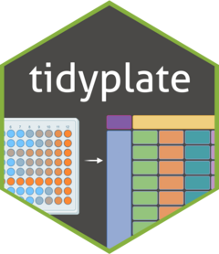

<!-- README.md is generated from README.Rmd. Please edit that file -->

```{r setup, include = FALSE}
knitr::opts_chunk$set(
  collapse = TRUE,
  comment = "#>",
  fig.path = "man/figures/README-",
  out.width = "100%"
)
```

# tidyplate <a href="https://www.shubhamdutta.com/tidyplate//"></a>

<!-- badges: start -->

[](https://github.com/shubhamdutta26/tidyplate/actions/workflows/R-CMD-check.yaml)
[](https://CRAN.R-project.org/package=tidyplate)
[](https://cran.r-project.org/package=tidyplate)
[](https://cran.r-project.org/package=tidyplate)
[](https://app.codecov.io/gh/shubhamdutta26/tidyplate)
<!-- badges: end -->

Microtiter plates or microplates have become a standard tool in analytical research and clinical diagnostic testing laboratories. They are convenient, high-throughput tools for organizing tissue culture, PCR tests (such as HIV/ COVID screening), or immunological assays such as ELISA, RIA and FIA. They offer many advantages over traditional assay formats including reduced sample and reagent volumes, increased throughput, and ease of automation. The goal of `tidyplate` is to help researchers convert different types of microplates into tibbles which can be used in data analysis. `tidyplate` accepts xlsx and csv files formatted in a specific way as input. `tidyplate` supports all types of standard microplate formats namely: 6-well, 12-well, 24-well, 48-well, 96-well, 384-well, and 1536-well plates.

`tidyplate` has five functions:

-   `tidy_plate`: Transforms the input file (xlsx or csv) into a tibble.
-   `generate_plate`: Exports a tibble into plate-shaped csv or xlsx file.
-   `check_plate`: Checks whether the input file is valid for use with `tidy_plate()`.
-   `view_plate_names`: Returns names/ id(s) of each plate in the input file.
-   `build_plate`: Generates a csv or xlsx template for each plate type.


```{r fig.cap = "This figure demonstrates how to format the 12-well plate input file. Colors are for visualization purposes only.", out.width = '100%'}
#| label: image
#| echo: false
knitr::include_graphics("man/figures/README_tidy_plate.png")
```

## Installation

To install tidyplate from CRAN:

```{r}
#| label: install
#| eval: false
install.packages("tidyplate")
```

You can install the development version of tidyplate from [GitHub](https://github.com/) with:

```{r}
#| label: github
#| eval: false
# install.packages("devtools")
devtools::install_github("shubhamdutta26/tidyplate")
```

## Formating the input data

The input xlsx or csv should be formatted in a specific way:

-   Top left corner must hold the name for that plate.
-   Column names should be: 1, 2, 3, and so on and so forth.
-   Row names should be: A, B, C, and so on and so forth.
-   There must be an empty row between each plate.

## Usage

This is an example which shows you how to use the `tidyplate`. If the input file is an xlsx file it reads the first sheet by default. Users can specify sheet using the `sheet` argument for an xlsx file. Users can also specify the variable name of column where well ids will be stored (defaults to "well"). Please make sure that `well_id` argument does not match individual plate names in the input file.

First check if the input file is valid or not:

```{r}
#| label: check_plate-xlsx
#| error: true
library(tidyplate)
file <- system.file("extdata", 
                    "example_12_well.xlsx", 
                    package = "tidyplate")
check_plate(file) # No error for valid file

incorrect_file <- system.file("extdata",
                              "incorrect_format.csv",
                              package = "tidyplate")
check_plate(incorrect_file) # Error type displayed
```

As mentioned above, the formatting of the input file is very important. A csv or 
excel template for each plate type can be created using the `build_plate` function:

```{r}
#| label: build-plate-demo
#| echo: true
#| eval: false
build_plate(plate_type = 96, 
            n_plates = 2, 
            file_type = "xlsx") # default is csv
```

If you want to retrieve the names of individual plates:

```{r}
#| label: view-plate-names-xlsx
view_plate_names(file)
```

Read and import the file as a tibble:

```{r}
#| label: tidy_plate-xlsx
data <- tidy_plate(file)
head(data)
```

Conversely, a dataframe or tibble can be re-exported back to a plate shaped csv
or xlsx file:

```{r}
#| label: generate-plate
#| echo: true
#| eval: false
generate_plate(data, well_id = "well", plate_type = 12, file = "plate.csv")
```

For more information on how to use functions on multiple files or multi-sheet excel
files read the `vignette("advanced")`.

## Cite

To cite package ‘tidyplate’ in publications use:

Dutta S (2024). _tidyplate: Transform Microplate Data into Tibbles_. R package
version 2.0.1.9000, https://github.com/shubhamdutta26/tidyplate,
<https://www.shubhamdutta.com/tidyplate/>.
