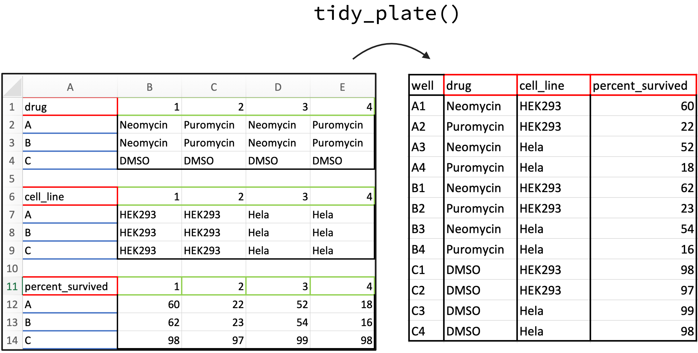

<!-- README.md is generated from README.Rmd. Please edit that file -->

# tidyplate

<!-- badges: start -->

[](https://github.com/shubhamdutta26/tidyplate/actions/workflows/R-CMD-check.yaml)
[](https://CRAN.R-project.org/package=tidyplate)
[](https://cran.r-project.org/package=tidyplate)
[](https://cran.r-project.org/package=tidyplate)
<!-- badges: end -->

Microtiter plates or microplates have become a standard tool in
analytical research and clinical diagnostic testing laboratories. They
are convenient, high-throughput tools for organizing tissue culture, PCR
tests (such as HIV/ COVID screening), or immunological assays such as
ELISA, RIA and FIA. They offer many advantages over traditional assay
formats including reduced sample and reagent volumes, increased
throughput, and ease of automation. The goal of `tidyplate` is to help
researchers convert different types of microplates into tidy dataframes
which can be used in data analysis. `tidyplate` accepts xlsx and csv
files formatted in a specific way as input. `tidyplate` supports all
types of standard microplate formats namely: 6-well, 12-well, 24-well,
48-well, 96-well, 384-well, and 1536-well plates.

`tidyplate` has two functions:

- `tidy_plate`: This function takes the input file (xlsx or csv) and
  transforms into a tidy dataframe.
- `check_plate`: This function checks whether the input file is valid
  for use with `tidy_plate()` function.

## Installation

To install tidyplate from CRAN:

``` r
install.packages("tidyplate")
```

You can install the development version of tidyplate from
[GitHub](https://github.com/) with:

``` r
# install.packages("devtools")
devtools::install_github("shubhamdutta26/tidyplate")
```

## Formating the input data file

<div class="figure">


<p class="caption">
This figure demonstrates how to format the 12-well plate input file.
Colors are for visualization purposes only.
</p>

</div>

The input xlsx or csv should be formatted in a specific way:

- Top left corner must hold the name for that plate.
- Column names should be: 1, 2, 3, and so on and so forth.
- Row names should be: A, B, C, and so on and so forth.
- There must be an empty row between each plate.

## Example

This is an example which shows you how to use the `tidyplate`. If the
input file is an xlsx file it reads the first sheet by default. Users
can specify sheet using the `sheet` argument for an xlsx file. Users can
also specify the variable name of column where well ids will be stored
(defaults to “well”). Please make sure that `well_id` argument does not
match individual plate names in the input file.

First check if the input file is valid or not:

``` r
library(tidyplate)
file_path <- system.file("extdata", "example_12_well.xlsx", package = "tidyplate")
check_plate(file_path)
#> example_12_well.xlsx: OK; Plate type: 12 well
```

Import the file as a tidy dataframe:

``` r
data <- tidy_plate(file_path)
#> Data: example_12_well.xlsx; Plate type: 12 well plate
head(data)
#> # A tibble: 6 × 4
#>   well  drug      cell_line percent_survived
#>   <chr> <chr>     <chr>                <int>
#> 1 A01   Neomycin  HEK293                  60
#> 2 A02   Puromycin HEK293                  22
#> 3 A03   Neomycin  Hela                    52
#> 4 A04   Puromycin Hela                    18
#> 5 B01   Neomycin  HEK293                  62
#> 6 B02   Puromycin HEK293                  23
```
