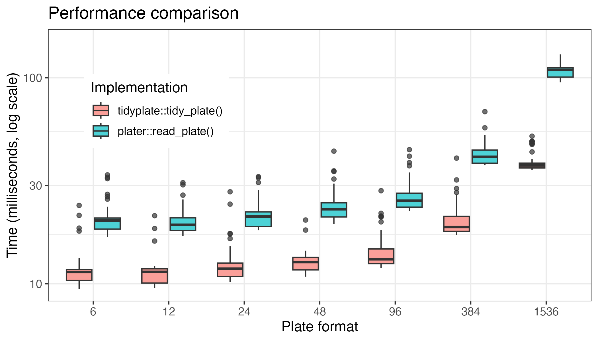

```{r setup, include = FALSE}
knitr::opts_chunk$set(
  collapse = TRUE,
  comment = "#>",
  fig.path = "man/figures/README-",
  out.width = "100%",
  dpi = 300
)
```

The `plater` package was an inspiration for me to write `tidyplate`. However there are two issues with `plater::read_plate()` function that I wanted to fix. These are:

1.  Performance.
2.  Incompatibility with excel files.

After running several tests I can say that `tidyplate::tidy_plate()` was significantly faster than `plater::read_plate()`. The benchmarking code is in the `inst` folder.

{width="620"}
